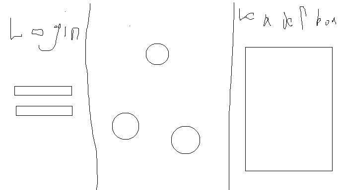

### The Reaction Time Game
# The primal urge each of has calls to compete and to dominate. Test the skills you have by measuring your reaciton time vs others in a unique simulator. You will have 60 seconds to push the randomly appearing button as many times as possible. You will be able to compete and create your very own login to be able to post your score on the global leaderboard. You will recieve real time updates about when your score is beaten and you will be able to reclaim your postion and the top. 
## Specification Deliverable
# HTML 
To build the structure you must use html to create the home page and login pages. The basic frame work is made with this.
# CSS 
To create the styling and design we will be using this to make this
# React
To be able to interact with the web page we must be use this
# Web Service
To be able to authenticate the user and connect with the leaderboards and scores this is needed.
# DB
To make a leader board this is necessary
# Web Socket
To have realtime updates we must have this

