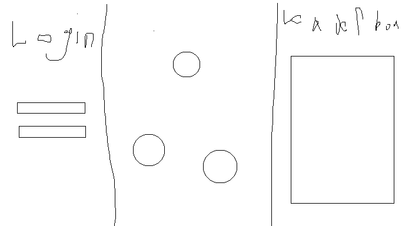

# Specification Deliverable
## Elevator Pitch
### The primal urge each of has calls to compete and to dominate. Test the skills you have by measuring your reaciton time vs others in a unique simulator. You will have 60 seconds to push the randomly appearing button as many times as possible. You will be able to compete and create your very own login with authentication to be able to post your score on the global leaderboard. You will recieve real time updates about when your score is beaten and you will be able to reclaim your postion and the top. 
# Uses of Tech
## HTML 
### [x]To build the structure you must use html to create the home page and login pages. The basic frame work is made with this.
## CSS 
### [x] To create the styling and design we will be using this to make this. This essential for designs. I intend to make sure the design is appealing to the eyes and use the designing skills i have learned.
## React
### [x]To be able to interact with the web page we must be use this. You will be able to click links and navigate the page. I plan to make it so you click and return to any page at any time as well as return easily
## Web Service
### [x]To be able to authenticate the user and connect with the leaderboards and scores I will use the Supabase API spefically that can list and update the scores.
## DB
### [x] To make a leader board this is necessary. It will store scores and be able to make leaderboard accurate using the Supabase API spefically.
## Web Socket
### [x]To have realtime updates we must have this. We can see when someone passes you on the leader board and react in turn by using the Supabase API spefically.
## Prototype

# Html Deliverable
- [X] **HTML pages** - Four different pages. One for each view. `index.html` (Login), `play.html`, `scores.html`, and `about.html`.
- [X] **Proper HTML element usage** - To build the structure you must use html to create the home page and login pages.
- [X] **Links** - I have created the frame work so when make the links it will work
- [X] **Text** - I have added a bit of text to index to make sure that it works
- [X] **3rd party API placeholder** - I have the places that i can put this created
- [X] **Images** - Added a placeholder into index
- [X] **Login placeholder** - I have made the login placeholder for when I make it 
- [X] **DB data placeholder** - Created a placeholder
- [X] **WebSocket placeholder** - Created a placeholder
# 🚀 CSS deliverable

- [x] **Header, footer, and main content body** - I finally made it so the index.css had everything i wanted and looked the way i wanted 
- [x] **Navigation elements** - I made the Nav bar disticnt and center with each of the links underlined so it works 
- [x] **Responsive to window resizing** - Bootstrap and `display:flex' did most the work here. I'm really happy with the game rendering.
- [x] **Application elements** - I used a lot of `display:flex` to get things to align correctly.
- [x] **Application text content** - I made it so the font was Bungee because it fit the mood that i was going for with the intense challenge
- [x] **Application images** - I centered and widened the image but left the place holder as is 

# React part1

- [x] Bundled the application using Vite
- [x] Converted startup HTML/CSS into React functional components
- [x] Created separate components for Login, Play, Scores, and About
- [x] Added React Router using BrowserRouter, Routes, Route, and NavLink
- [x] Added my name to the application
- [x] Added a link to my GitHub repository
- [x] Deployed the startup React application to production